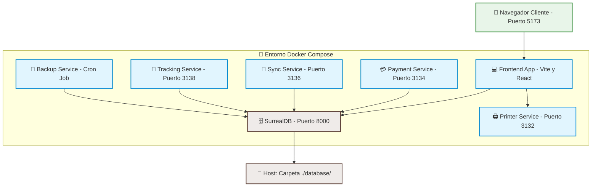

# 🍽️ Sistema POS para Restaurante — README en Español

> **Clonado desde:** [https://github.com/ahmedali5530/restaurant-pos](https://github.com/ahmedali5530/restaurant-pos)
> **Última versión verificada:** commit `9de419f` ("updated inventory")
> **Ruta local:** `E:\Sistemas Personales\Sistema_restaurant\`

---

## 🚀 Instalación rápida (3 comandos)

```bash
cd "E:/Sistemas Personales/Sistema_restaurant"
docker compose up -d
# Abre en el navegador: http://localhost:5173
```

**PINs de acceso (cámbialos antes de producción):**

| PIN | Rol |
|---|---|
| `1234` | Admin |
| `0000` | Manager |
| `5555` | Super admin |

---

## ⚡ ¿Qué es esto?

Un **sistema POS completo para restaurantes** (cafés, restaurantes, food trucks, cadenas y delivery) con:

- ✅ **Funciona offline** — si se cae el WiFi del local, sigue operando
- ✅ **Sincroniza con la nube** cuando vuelve la conexión
- ✅ **Imprime tickets** en impresoras térmicas ESC/POS (USB, red, Bluetooth)
- ✅ **Multi-idioma** — incluye **Español** 🇪🇸 + 9 idiomas más con RTL
- ✅ **Multi-sucursal** — sincroniza entre locales
- ✅ **Delivery + GPS** — gestión completa de repartidores con mapa
- ✅ **Backups automáticos** — cada 12 horas
- ✅ **Gestión de comandas** — por mesa, por asiento, multi-pedido simultáneo

---

## 🧱 Arquitectura (6 contenedores Docker)

| Servicio | Puerto | Qué hace |
|---|---|---|
| `app` | 5173 | Frontend React (lo que abre el mesero) |
| `surrealdb` | 8000 | Base de datos (multi-modelo, realtime) |
| `printer` | 3132 | Servicio de impresión térmica |
| `payment` | 3134 | Pagos (Stripe, PayPal, JazzCash) |
| `sync` | 3136 | Sincronización nube ↔ local |
| `tracking` | 3138 | Tracking GPS de delivery |
| `backup` | cron | Backups automáticos cada 12h |

---

## 📋 Requisitos del PC del restaurante

| Componente | Mínimo | Recomendado |
|---|---|---|
| Sistema operativo | Windows 10/11, macOS, Linux | Windows 11 o Ubuntu LTS |
| RAM | 4 GB | 8 GB o más |
| Disco libre | 10 GB | 20 GB SSD |
| CPU | 2 cores | 4 cores |
| Docker | Docker Desktop o Docker Engine + Compose v2 | Idem |

### Hardware adicional recomendado (no obligatorio para arrancar)

- 🖨️ **Impresora térmica ESC/POS** — USB o Ethernet (~€40-80). Marcas: Epson TM-T20, Xprinter XP-58, Star TSP143
- 📺 **Pantalla táctil 15"** si quieres POS de mostrador (~€150-300)
- 💵 **Cajón portamonedas** con apertura RJ11 desde la impresora (~€30-60)
- 🔌 **UPS / SAI** de 600 VA (~€50) — protege de cortes eléctricos
- 📡 **WiFi estable** con IP fija en el PC del restaurante

---

## 🔧 Instalación paso a paso

### 1. Instalar Docker

**Windows:**
1. Descarga Docker Desktop: https://www.docker.com/products/docker-desktop/
2. Instala y reinicia si te lo pide
3. Abre Docker Desktop una vez para terminar de configurar

**Linux (Ubuntu/Debian):**
```bash
curl -fsSL https://get.docker.com | sh
sudo usermod -aG docker $USER
# Cierra sesión y vuelve a entrar
```

### 2. Clonar (ya hecho en esta máquina)

Este repositorio ya está clonado en:
```
E:\Sistemas Personales\Sistema_restaurant
```

Si necesitas volver a clonarlo en otro PC:
```bash
git clone https://github.com/ahmedali5530/restaurant-pos.git
```

### 3. Configurar credenciales

Ya hay un `.env` con valores por defecto (`root/root`) que funciona para pruebas locales. **Antes de exponer a internet o usar en producción, cambia:**

```bash
SURREAL_USER=tu_usuario_seguro
SURREAL_PASS=tu_password_seguro_y_largo
```

Edita el archivo `.env` con cualquier editor de texto (Notepad, VSCode, nano...).

### 4. Levantar todos los servicios

```bash
cd "E:/Sistemas Personales/Sistema_restaurant"
docker compose up -d
```

La primera vez tarda 2-5 minutos descargando imágenes Docker (~2 GB). Las siguientes veces arranca en ~30 segundos.

### 5. Verificar que funciona

```bash
docker compose ps
# Verás algo así:
#   posr-react-app-1         Running   0.0.0.0:5173->5173/tcp
#   posr-react-surrealdb-1   Running   0.0.0.0:8000->8000/tcp
#   posr-react-printer-1     Running   0.0.0.0:3132->3132/tcp
#   ...
```

Ver logs en vivo si algo falla:
```bash
docker compose logs -f app
```

### 6. Abrir en el navegador

| Desde | URL |
|---|---|
| El propio PC | `http://localhost:5173` |
| Otra tablet/PC en la misma WiFi | `http://<IP-DEL-PC>:5173` |

Para saber tu IP local:
- **Windows:** `ipconfig` → busca **IPv4 Address** (ej: `192.168.1.50`)
- **Linux/Mac:** `ip addr` o `ifconfig`

### 7. Login

```
PIN: 1234    (admin)
PIN: 0000    (manager)
PIN: 5555    (super admin)
```

**⚠️ Cambia estos PINs nada más entrar en producción.**

---

## 🖨️ Conectar la impresora térmica

### Impresora USB

1. Conecta la impresora al PC del restaurante y enciéndela
2. En Windows, abre **Administrador de dispositivos** → **Puertos (COM & LPT)** y anota el puerto (ej: `USB Serial Port (COM3)`)
3. Edita `printing/.env`:
   ```
   PRINTER_TYPE=usb
   PRINTER_VENDOR=0x04b8    # Epson = 04b8, Star = 04b8 también en algunos modelos
   PRINTER_PRODUCT=0x0202   # TM-T20 — busca en el manual de tu impresora
   ```
4. Reinicia el servicio de impresión:
   ```bash
   docker compose restart printer
   ```

### Impresora por red (Ethernet / WiFi)

1. Configura IP fija en la impresora (manual del fabricante, suele ser navegador web → `http://192.168.1.200`)
2. Edita `printing/.env`:
   ```
   PRINTER_TYPE=network
   PRINTER_IP=192.168.1.200
   PRINTER_PORT=9100
   ```
3. Reinicia el servicio de impresión.

### Ver modelos de impresoras soportadas
Visita el driver DB: https://github.com/receipt-print-hq/escpos-printer-db

---

## 🔄 Comandos útiles del día a día

```bash
# Estado actual
docker compose ps

# Ver logs en vivo (todos los servicios)
docker compose logs -f

# Ver logs de un servicio concreto
docker compose logs -f app        # frontend
docker compose logs -f printer    # impresión
docker compose logs -f surrealdb  # base de datos

# Reiniciar un servicio (ej. tras cambiar config de impresora)
docker compose restart printer

# Apagar todo (opcional al cierre)
docker compose down

# Arrancar al día siguiente
docker compose up -d

# Actualizar el sistema cuando el autor publique cambios
git pull
docker compose up -d --build
```

---

## 🛡️ Para usar en producción (post-demo)

Antes de exponer esto a empleados reales, **cambia obligatoriamente:**

| Qué | Acción | Por qué |
|---|---|---|
| PINs por defecto | Cambia `1234`, `0000`, `5555` desde el panel admin | Cualquiera los sabe |
| `SURREAL_USER`/`SURREAL_PASS` en `.env` | Cambiar `root/root` a algo fuerte | Credenciales triviales |
| HTTPS | Poner Nginx o Caddy delante | Evita tráfico en plano |
| Firewall | Abrir solo 5173 al WiFi del local, **NO** a internet | Evita exposición |
| Backups | Verificar que el contenedor `backup` está corriendo | Copia `./backups/surrealdb/` a USB/disco externo regularmente |
| IP fija | Configurar IP estática en el PC | Las tablets perderán acceso si cambia |
| Zona horaria | En `docker-compose.yml` cambiar `TZ: UTC` por `TZ=Europe/Madrid` | Reportes con hora correcta |

---

## 🆘 Solución de problemas

### "Puerto 5173 ya en uso"
Cierra el programa que lo esté usando, o edita el puerto en `docker-compose.yml`:
```yaml
ports:
  - "5174:5173"   # usa 5174 externo en lugar de 5173
```

### "permission denied" al usar Docker en Linux
```bash
sudo usermod -aG docker $USER
# Cierra sesión y vuelve a entrar
```

### La página carga pero no conecta con la base de datos
```bash
docker compose logs surrealdb
# Verás las credenciales que espera. Compáralas con las del .env del frontend.
```

### El navegador se queda colgado cargando
```bash
docker compose restart app
```

### La impresora no imprime
1. Verifica que el contenedor `printer` está corriendo: `docker compose ps`
2. Comprueba los logs: `docker compose logs -f printer`
3. Verifica credenciales en `printing/.env`

### Olvidé un PIN
Conecta directamente a SurrealDB y reset:
```bash
docker compose exec surrealdb surreal sql \
  --endpoint ws://localhost:8000 \
  --user root --pass root \
  --namespace posr --database posr \
  "SELECT * FROM user WHERE role='admin';"
```

---

## 💾 Dónde están tus datos

```
E:\Sistemas Personales\Sistema_restaurant\
├── database\              # Datos de SurrealDB (mientras corre el contenedor)
├── backups\surrealdb\     # Backups automáticos .surql cada 12h
├── .env                   # Configuración (EDITAR con cuidado)
└── ... resto del código
```

**⚠️ La carpeta `database\` contiene todos tus datos de ventas.** Haz backup regularmente.

### Backup manual adicional
```bash
docker compose exec surrealdb surreal export \
  --endpoint http://localhost:8000 \
  --user root --pass root \
  --namespace posr --database posr \
  > backup_manual_$(date +%Y%m%d).surql
```

### Restaurar backup
```bash
docker compose exec -T surrealdb surreal import \
  --endpoint http://localhost:8000 \
  --user root --pass root \
  --namespace posr --database posr \
  < backup_manual_20260715.surql
```

---

## 🌐 Acceso desde tablets / otros PCs

Para que los camareros usen tablets o para tener varias cajas:

1. **Configura IP fija** en el PC del restaurante (en el router o en Windows → Adaptador de red → IPv4 → Propiedades)
2. **Abre el firewall** de Windows para Docker Desktop (red privada)
3. Cada tablet accede a `http://<IP-FIJA>:5173`
4. **Recomendado:** poner un dominio local + HTTPS con Caddy o nginx para evitar el aviso de "sitio no seguro" en Chrome

---

## 📞 ¿Necesitas ayuda?

- Documentación oficial: https://github.com/ahmedali5530/restaurant-pos
- Demo en vivo oficial: https://ahmedali5530.xyz/posr (login: `1234`, `0000` o `5555`)
- Driver DB impresoras: https://github.com/receipt-print-hq/escpos-printer-db

---

## 🗺️ Estructura y Flujo del Proyecto

El sistema está dividido en microservicios encapsulados en contenedores Docker. A continuación se detalla cómo se comunican entre sí y cómo fluyen los datos:



---

## 🛠️ Historial de Errores de Inicialización y Soluciones

Durante el primer inicio del proyecto en un entorno local de Windows usando Docker, se detectaron y corrigieron los siguientes inconvenientes críticos:

### 1. Error de binding nativo de Rolldown (`@rolldown/binding-linux-x64-gnu`)
* **Síntoma:** El contenedor de la `app` (frontend) fallaba inmediatamente después de `npm run dev` indicando que no encontraba el native binding de Rolldown para Linux.
* **Causa:** El entorno del host es Windows, pero Docker ejecuta contenedores Linux. Debido a un bug conocido de npm con dependencias opcionales multiplataforma, la instalación basada en el lockfile del host saltaba el compilado nativo correspondiente a Linux.
* **Solución:** Se editó el [Dockerfile.app](file:///e:/Sistemas%20Personales/Sistema_restaurant/Dockerfile.app) para forzar la instalación explícita del binding nativo agregando la instrucción `npm install @rolldown/binding-linux-x64-gnu --legacy-peer-deps`. Luego, se reconstruyó la imagen con `docker compose build --no-cache app`.

### 2. Tablas inexistentes en la base de datos (`The table 'user' / 'floor_table' / 'integration_installed_provider' does not exist`)
* **Síntoma:** Al arrancar el frontend, la consola de desarrollo del navegador mostraba errores persistentes de SurrealDB indicando que las tablas requeridas no existían.
* **Causa:** El directorio `./database` del host estaba vacío. Al iniciar SurrealDB por primera vez, este se inicializa en blanco y requiere que se apliquen los esquemas y las semillas demo de forma explícita.
* **Solución:** Se copiaron los archivos de migración y datos de prueba al contenedor de base de datos y se ejecutaron las importaciones usando el binario de SurrealDB:
  ```bash
  # Copiar archivos al contenedor
  docker cp migrations/latest.surql sistema_restaurant-surrealdb-1:/latest.surql
  docker cp migrations/demo-data.surql sistema_restaurant-surrealdb-1:/demo-data.surql

  # Aplicar esquema
  docker compose exec surrealdb /surreal import --endpoint http://localhost:8000 --user root --pass root --namespace posr --database posr /latest.surql

  # Cargar datos de prueba (incluye usuarios por defecto)
  docker compose exec surrealdb /surreal import --endpoint http://localhost:8000 --user root --pass root --namespace posr --database posr /demo-data.surql
  ```

---

## ⚠️ Aviso importante

Este proyecto es **open source sin licencia declarada** (campo `license: null` en GitHub). Puedes estudiarlo y modificarlo localmente, pero **antes de cualquier uso comercial revisa la situación legal** abriendo un issue al autor pidiéndole que añada una licencia estándar (MIT, Apache-2.0).

El autor es `ahmedali5530`. El repositorio está activo (commit más reciente el día que se clonó).

---

**Clonado y personalizado:** julio 2026 · Sistema POS para restaurante local
